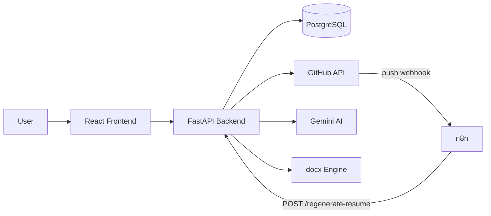

# Resume Auto-Updater

[](https://react.dev)
[](https://vitejs.dev)
[](https://tailwindcss.com)
[](https://fastapi.tiangolo.com)
[](https://www.postgresql.org)
[](https://python-docx.readthedocs.io)
[](https://ai.google.dev)
[](https://n8n.io)
[](https://www.docker.com)

Connect GitHub to a `.docx` resume. On every push to `main`, the app picks strong projects, writes ATS-friendly bullets with Gemini, updates the document without breaking layout, and stores a new version.

## Project overview and value

Students and junior engineers forget to update the Projects section after they ship code. This product watches GitHub, regenerates that section, scores ATS likelihood, and keeps a version history so you can download or roll back.

In production the loop is: **push code → GitHub webhook → n8n → FastAPI pipeline → new resume version**.

## Architecture



A larger diagram lives in [`docs/ARCHITECTURE.md`](docs/ARCHITECTURE.md). Database tables and keys: [`docs/DATABASE_SCHEMA.md`](docs/DATABASE_SCHEMA.md).

## Tech stack

| Layer | Tools |
|---|---|
| Frontend | React, Vite, Tailwind CSS |
| Backend | FastAPI, SQLAlchemy, python-jose, httpx |
| Database | PostgreSQL (SQLite fallback for local demos) |
| Resume files | python-docx / OpenXML (`docx_engine`) |
| AI | Google Gemini |
| Automation | n8n webhook workflow |
| Ops | Docker Compose for Postgres, pipeline health + load scripts |

## Quick start (local)

### 1. Database

PostgreSQL via Docker:

```bash
docker compose up -d postgres
```

Apply schema and Day 7 views (from `psql` or any SQL client):

```bash
psql "$DATABASE_URL" -f backend/db/scheme.sql
psql "$DATABASE_URL" -f backend/db/views.sql
```

If `DATABASE_URL` is empty, the backend can still run against a local SQLite file for demos.

### 2. Backend

```bash
cd backend
python -m venv .venv
# Windows:
.venv\Scripts\activate
# macOS / Linux:
# source .venv/bin/activate
pip install -r requirements.txt
copy .env.example .env   # then fill secrets
uvicorn app.main:app --reload --host 127.0.0.1 --port 8000
```

API docs: [http://127.0.0.1:8000/docs](http://127.0.0.1:8000/docs)

### 3. Frontend

```bash
cd frontend
npm install
copy .env.example .env   # VITE_BACKEND_URL=http://localhost:8000
npm run dev
```

App: [http://localhost:5173](http://localhost:5173)  
Offline demo hub: `/demo`

### 4. n8n automation

```bash
n8n
```

Editor: [http://localhost:5678](http://localhost:5678)

Import `workflows/n8n_production_workflow_v1.0.json` (or `n8n/workflows/n8n_full_live_pipeline.json`), set it **Active**, and point GitHub’s webhook to:

`http://<public-or-local-host>:5678/webhook/github-push`

Use the same HMAC secret the Code node expects (`GITHUB_WEBHOOK_SECRET` / `resume001122--` in the current workflow).

### Docker deployment notes

`docker-compose.yml` starts PostgreSQL for the team. Backend and frontend still run locally in this sprint (Person C can wrap them in images later). Required env vars: `DATABASE_URL`, `JWT_SECRET`, `GEMINI_API_KEY`, `GITHUB_CLIENT_ID`, `GITHUB_CLIENT_SECRET`, `FRONTEND_URL`.

## API reference

Base URL: `http://127.0.0.1:8000`

| Method | Path | Auth | Purpose |
|---|---|---|---|
| GET | `/health` | none | Liveness |
| GET | `/` | none | Redirect to Swagger |
| POST | `/auth/signup` | none | Create user, return JWT |
| POST | `/auth/login` | none | Login, return JWT |
| GET | `/auth/github/login` | optional query | GitHub OAuth start |
| GET | `/auth/github/callback` | GitHub | OAuth callback |
| GET | `/projects` | Bearer JWT | Fetch, rank, store GitHub projects |
| POST | `/resumes/upload` | Bearer JWT | Upload `.docx` |
| GET | `/resumes/current` | Bearer JWT | Latest resume metadata |
| GET | `/resumes/{id}/versions` | Bearer JWT | Version list |
| POST | `/resumes/regenerate` | Bearer JWT | Run AI + docx + ATS pipeline |
| GET | `/resumes/download/{version_id}` | Bearer JWT | Download a version |
| POST | `/regenerate-resume` | JWT **or** `X-Service-Secret` | Same pipeline; used by n8n |

Send JSON with `Content-Type: application/json` except file upload (`multipart/form-data`).

n8n body example:

```json
{
  "user_id": "<uuid>",
  "repo_name": "resume-auto-updater",
  "commit_message": "feat: add webhook",
  "trigger_source": "github_webhook"
}
```

## Day 8 / Day 9 checks

```bash
python scripts/monitor_pipeline.py
python scripts/verify_day7_views.py
python scripts/load_test_automation.py
```

Load-test plan: [`docs/LOAD_TEST_PLAN.md`](docs/LOAD_TEST_PLAN.md)

## Repo structure

```
frontend/     React (Vite + Tailwind)
backend/      FastAPI, SQLAlchemy, routers
docx_engine/  .docx parse / inject / format
n8n/          working n8n exports
workflows/    production n8n JSON v1.0
docs/         architecture, schema, load-test plan
scripts/      health monitor, view checks, load test
```

## Team roles

| Role | Person | Focus |
|---|---|---|
| Frontend | A | Login, signup, dashboard, GitHub connect, upload UI |
| QA / Demo | B | Showcase, test checklist, live demo |
| Backend / DevOps | C | FastAPI, OAuth, deployment, secrets |
| AI / Docx | D | Gemini bullets, ATS scoring, document engine |
| DB / Automation / Coordination | E | Schema, views, n8n, load test, docs |

## License

Frontend includes the default Vite license file. Team project — not published as a product.
