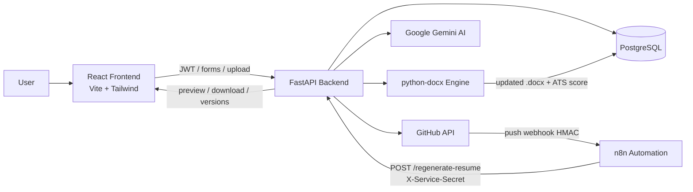

# System Architecture

End-to-end flow for Resume Auto-Updater.

## What happens on a GitHub push

1. Developer pushes code to `main`.
2. GitHub POSTs a signed webhook to n8n.
3. n8n verifies HMAC, keeps only `main`, then calls FastAPI.
4. FastAPI fetches repos, ranks projects, asks Gemini for bullets, rewrites the `.docx`, stores a new version + ATS score.
5. Success is logged in `automation_logs`. Failure can alert the team channel.

See also `docs/DATABASE_SCHEMA.md` for tables and keys.
