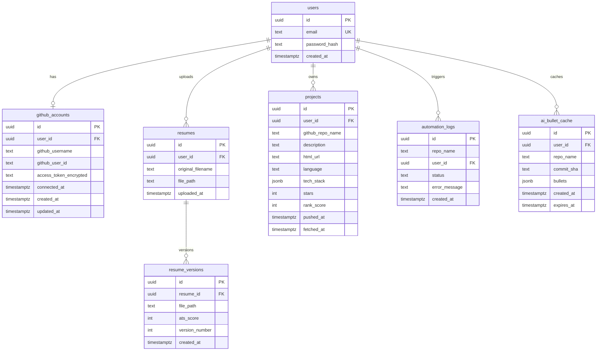

# Database schema

Resume Auto-Updater stores users, GitHub links, resume files, generated versions, ranked projects, optional AI cache, and automation logs.

This file is the Day 10 handoff document. It matches the SQL in `backend/db/scheme.sql`, the Day 7 indexes/views in `backend/db/views.sql`, and the SQLAlchemy models under `backend/app/models/`.

## Entity-relationship diagram



`automation_logs` is in production (n8n success path + FastAPI `/regenerate-resume`). It is documented here even though the original five-table sketch did not name it.

## Table catalog

### 1. `users`

| Field | Value |
|---|---|
| Description | App accounts. One row per signup. |
| Primary key | `id` UUID (`gen_random_uuid()`) |
| Foreign keys | none |
| Unique | `email` |

| Column | Type | Notes |
|---|---|---|
| id | UUID | PK |
| email | TEXT / VARCHAR | unique, not null |
| password_hash | TEXT | bcrypt hash, never store plain passwords |
| created_at | TIMESTAMPTZ | default `now()` |

**Indexes:** unique index on `email`; SQLAlchemy also indexes `email`.

**ON DELETE:** deleting a user cascades to `github_accounts`, `resumes`, `projects` (schema). `automation_logs.user_id` is `ON DELETE SET NULL`.

---

### 2. `github_accounts`

| Field | Value |
|---|---|
| Description | One GitHub OAuth connection per user. Token is encrypted at rest. |
| Primary key | `id` UUID |
| Foreign keys | `user_id` → `users.id` |

| Column | Type | Notes |
|---|---|---|
| id | UUID | PK |
| user_id | UUID | FK, indexed |
| github_username | VARCHAR / TEXT | not null |
| github_user_id | VARCHAR | optional, from GitHub API (model) |
| access_token_encrypted | TEXT | schema name; model field `encrypted_access_token` |
| connected_at | TIMESTAMPTZ | schema |
| created_at / updated_at | TIMESTAMPTZ | model timestamps |

**Indexes:** `idx_github_accounts_user_id` on `user_id`.

**ON DELETE:** `CASCADE` from `users` in `scheme.sql`.

---

### 3. `resumes`

| Field | Value |
|---|---|
| Description | Original uploaded `.docx` files. |
| Primary key | `id` UUID |
| Foreign keys | `user_id` → `users.id` **ON DELETE CASCADE** |

| Column | Type | Notes |
|---|---|---|
| id | UUID | PK |
| user_id | UUID | FK, not null |
| original_filename | TEXT / VARCHAR | original upload name |
| file_path | TEXT | disk path under `STORAGE_DIR` |
| uploaded_at | TIMESTAMPTZ | default `now()` |

**Indexes:** `idx_resumes_user_id` on `(user_id, uploaded_at DESC)`.

---

### 4. `resume_versions`

| Field | Value |
|---|---|
| Description | Each AI regeneration: new file, ATS score, version number. |
| Primary key | `id` UUID |
| Foreign keys | `resume_id` → `resumes.id` **ON DELETE CASCADE** |

| Column | Type | Notes |
|---|---|---|
| id | UUID | PK |
| resume_id | UUID | FK, not null |
| file_path | TEXT | generated `.docx` |
| ats_score | INT | 0–100 style score |
| version_number | INT | 1, 2, 3… |
| created_at | TIMESTAMPTZ | default `now()` |

**Indexes:** `idx_resume_versions_resume_id_created` on `(resume_id, created_at DESC)`.

---

### 5. `projects`

| Field | Value |
|---|---|
| Description | Ranked GitHub repos used to write the Projects section. |
| Primary key | `id` UUID |
| Foreign keys | `user_id` → `users.id` **ON DELETE CASCADE** |

| Column | Type | Notes |
|---|---|---|
| id | UUID | PK |
| user_id | UUID | FK, not null |
| github_repo_name | TEXT / VARCHAR | not null |
| description | TEXT | nullable |
| html_url | VARCHAR | model extra |
| language | VARCHAR | model extra |
| tech_stack | TEXT[] / JSONB | schema uses `TEXT[]`; SQLAlchemy model uses JSON |
| stars | INT | model extra |
| rank_score | INT / FLOAT | ranking for “most impressive” |
| pushed_at | TIMESTAMPTZ | last GitHub push (model) |
| fetched_at | TIMESTAMPTZ | last refresh |

**Indexes:** `idx_projects_user_id_rank` on `(user_id, rank_score DESC)`.  
**Unique:** `uix_user_repo_name` on `(user_id, github_repo_name)` in the ORM.

---

### 6. `ai_bullet_cache`

| Field | Value |
|---|---|
| Description | Optional cache of Gemini bullet JSON keyed by user + repo + commit. Stops paying for the same commit twice. |
| Primary key | `id` UUID |
| Foreign keys | `user_id` → `users.id` **ON DELETE CASCADE** |

| Column | Type | Notes |
|---|---|---|
| id | UUID | PK |
| user_id | UUID | FK |
| repo_name | VARCHAR | which repo the bullets describe |
| commit_sha | VARCHAR | Git commit that produced this cache row |
| bullets | JSONB | model output from Gemini |
| created_at | TIMESTAMPTZ | insert time |
| expires_at | TIMESTAMPTZ | TTL for stale cache |

**Suggested indexes:** `(user_id, repo_name, commit_sha)` unique; `expires_at` for cleanup jobs.

This table is specified for Day 10 documentation. Add it in a later migration if Person D starts caching Gemini responses. It is not required for the live n8n path today.

---

### 7. `automation_logs` (production)

| Field | Value |
|---|---|
| Description | One row per n8n / pipeline run. |
| Primary key | `id` UUID |
| Foreign keys | `user_id` → `users.id` **ON DELETE SET NULL** |

| Column | Type | Notes |
|---|---|---|
| id | UUID | PK |
| repo_name | TEXT | not null |
| user_id | UUID | nullable FK |
| status | TEXT | `SUCCESS` / `FAILED` |
| error_message | TEXT | nullable |
| created_at | TIMESTAMPTZ | default `now()` |

**Indexes:** `idx_automation_logs_user_id` on `(user_id, created_at DESC)`.

## Views (Day 7)

| View | Purpose |
|---|---|
| `v_user_dashboard_summary` | One row per user: GitHub name, latest resume, version, ATS, last update |
| `v_resume_version_details` | Version timeline joined to resume + user |
| `v_resume_version_history` | Alias of the details view |

Dashboard screens should read views instead of repeating the same joins.

## Normalization and query choices

- **3NF-style split:** login data (`users`) is not mixed with OAuth tokens, files, or GitHub repos. That keeps password hashes away from resume blobs and tokens.
- **1:1 GitHub:** one `github_accounts` row per user in practice (application rule).
- **1:N resumes and versions:** uploading again does not overwrite history; `resume_versions` grows.
- **Encrypted tokens:** GitHub access tokens are ciphertext in the database, not plain OAuth strings.
- **Indexes match real queries:** dashboard by `user_id`, versions by `(resume_id, created_at DESC)`, projects by `(user_id, rank_score DESC)`.
- **Cache table:** `ai_bullet_cache` is the denormalized exception: it stores AI JSON on purpose so we do not re-call Gemini for the same commit.

Verify indexes and view latency with:

```bash
python scripts/verify_day7_views.py
```
