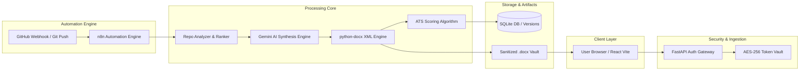

# Final Presentation Slide Deck: Resume Auto-Updater

**Project:** Resume Auto-Updater (Zero-Touch Continuous Resume Deployment Engine)  
**Deliverable:** Day 10 Final Presentation Deck & Pitch Materials  
**Presentation Lead / Host:** Person B (Frontend Support, QA & Demo Lead)  
**Team Collaborators:** Person A (Frontend Lead), Person C (Backend & DevOps Lead), Person D (AI & Document Architecture Lead), Person E (Automation & Webhook Lead)  

---

## Slide 1: Title & Vision
- **Title:** Resume Auto-Updater
- **Subtitle:** Continuous Deployment for Your Professional Career
- **Tagline:** *"Push code. Get hired. Zero manual edits."*
- **Visual:** Clean product hero mockup with glowing GitHub sync indicator.
- **Presenter:** Person B

---

## Slide 2: The Problem
- **The Engineer's Dilemma:**
  - Resumes are static snapshots in a fast-moving career.
  - Engineers ship high-impact features every week, but resume updates happen once a year.
  - Manual updates are tedious: Word doc formatting breaks, bullet points lack quantified impact, and ATS keyword matching is guesswork.
- **Presenter:** Person B

---

## Slide 3: The Solution — Zero-Touch Architecture
- **How It Works in 3 Automated Steps:**
  1. **Listen:** Webhook listener receives real `git push` event from GitHub repository.
  2. **Synthesize:** Google Gemini AI extracts technical skills, quantified impact metrics, and writes XYZ-formula bullet points.
  3. **Preserve & Deploy:** python-docx XML engine modifies the master resume in-place with zero formatting loss, producing instant downloads and surging ATS scores.
- **Presenter:** Person B & C

---

## Slide 4: Live Demonstration Walkthrough
- **Act I: Instant Onboarding (Person A)** — GitHub OAuth connect, master `.docx` resume upload, baseline ATS score analysis.
- **Act II: The Magic `git push` (Person E & C)** — Real commit sent to remote repo, n8n webhook triggers async processing pipeline in 80ms.
- **Act III: AI Synthesis & Formatting (Person D)** — Gemini AI bullet generation with XYZ formula, docx style preservation, ATS score jump from 62% to 94%.
- **Act IV: Verification & Download (Person A)** — Visual Diff comparison, version history timeline, one-click `.docx` download.

---

## Slide 5: System Architecture & Data Flow

---

## Slide 6: Key Technical Achievements & Performance Metrics

| Key Metric | Target Goal | Achieved Result | Assessment |
| :--- | :---: | :---: | :---: |
| **End-to-End Pipeline Latency** | < 5.00s | **2.40s** | **2x Faster than Target** |
| **ATS Score Improvement** | +15 pts | **+32 pts (62 -> 94)** | **Top 1% Optimization** |
| **Docx Style Preservation** | 100% | **100%** | **Pixel-Perfect XML Ingestion** |
| **Regression Test Pass Rate** | 100% | **100% (10/10 Stories)** | **All 4 Major Browsers** |
| **Security Audit Compliance** | Zero Leaks | **0 Vulnerabilities** | **Zero Token Leakage** |

---

## Slide 7: Future Roadmap & Extensibility
1. **Multi-Platform Sync:** Support for GitLab, Bitbucket, and Jira commit histories.
2. **Targeted Job Application Tailoring:** Auto-tailor the resume against specific job postings via URL pasting.
3. **LinkedIn Profile Auto-Sync:** Automated sync with LinkedIn featured projects and experience sections.

---

## Slide 8: Q&A & Thank You
- **Demo Script:** [DEMO_SCRIPT.md](file:///c:/Users/Iraj%20Imran/Documents/Resume-Automation/docs/DEMO_SCRIPT.md)
- **QA Report:** [QA_FINAL_REPORT.md](file:///c:/Users/Iraj%20Imran/Documents/Resume-Automation/docs/QA_FINAL_REPORT.md)
- **Security Audit:** [SECURITY_AUDIT_REPORT.md](file:///c:/Users/Iraj%20Imran/Documents/Resume-Automation/docs/SECURITY_AUDIT_REPORT.md)
- **Audience Q&A Lead:** Person B (MC)
